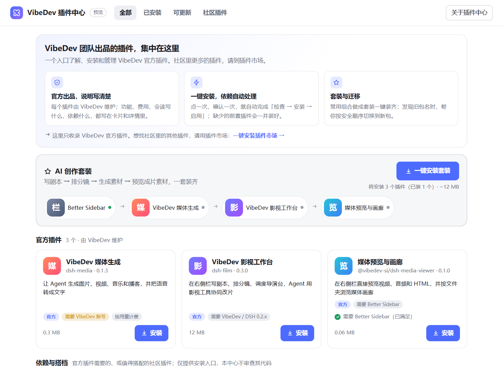
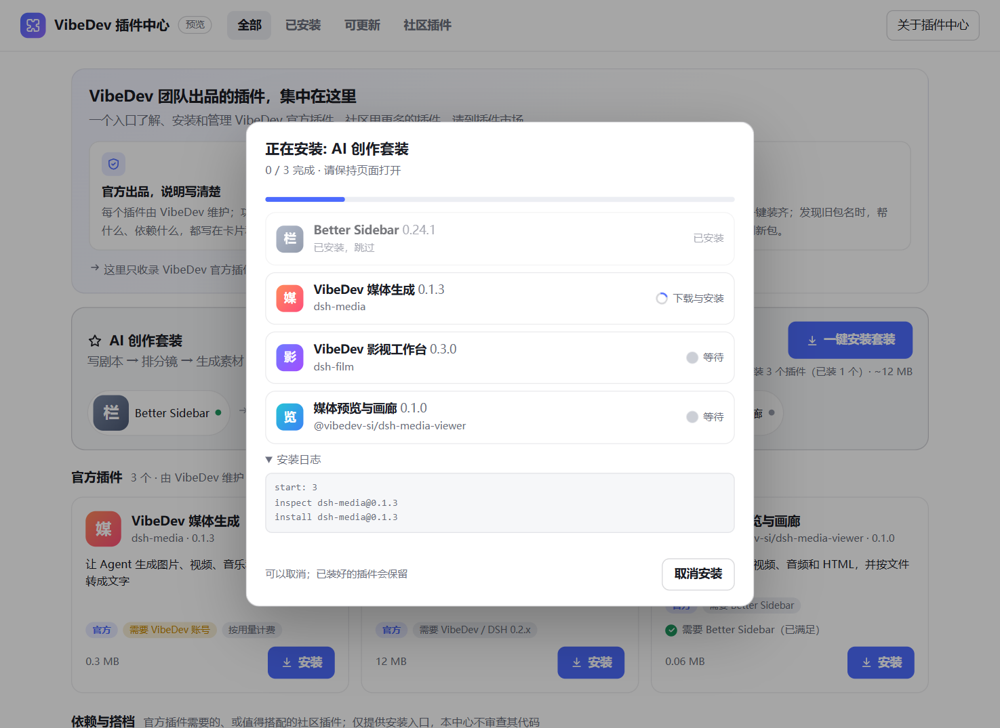
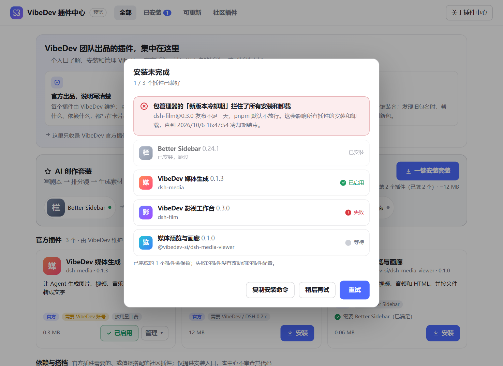

# @vibedev-si/dsh-ecosystem · VibeDev 插件中心

> 集中了解、**一键安装**和管理 VibeDev 官方插件。
> Learn about, one-click install and manage the official VibeDev plugins.



## 它做什么

- **官方插件，说明写清楚**：每个插件的功能、费用、会读写什么、依赖什么，都写在卡片和详情里；需要 VibeDev 账号、按用量计费的会明确标出。
- **一键安装**：点一次、确认一次，自动完成「检查 → 安装 → 启用」，缺少的前置插件一并装好。
- **套装**：「AI 创作套装」= Better Sidebar + VibeDev 账号与模型 + 影视工作台 + 媒体预览，一次装齐，已装的自动跳过。
- **旧包名迁移**：发现旧包名（例如 `dsh-media-viewer`、改名为 `@vibedev-si/dsh-vibedev` 的 `dsh-media`）时，按"新包装但不启用 → 停用旧包 → 启用新包 → 新包启用成功后卸载旧包"的顺序切换，避免两者同时启用互相冲突；失败时自动把旧包恢复，不会让你两个都没有。旧包还在时直接安装新包（单装、套装或作为前置插件）也按同样的顺序切换。
- **管理与更新**：停用、启用、卸载、更新；有新版本时按钮变"更新到 x"。
- **应用内置插件**：仍显示在目录和「已安装」里，标注「应用内置」与应用实际提供的版本；通过默认配置启用的也会识别。安装套装或影视插件会复用它，不重复安装；内置版本随应用更新，本中心不单独更新或卸载。新账号插件已内置时，旧外置 `dsh-media` 的迁移只停用、卸载旧包。
- **插件中心自己的新版本**：点右上角「检查更新」，会告诉你有没有新版本。插件中心不能给自己更新，所以会给出完整包名和卸载重装的步骤；如果新版本发布不足一天，还会提示 pnpm 的冷却期可能让更新被拦住，并给出可以更新的时间。
- **社区插件**：一键安装社区的插件市场 `dshmarket`，已装时在「社区插件」标签页里嵌入它的界面。本中心**只收录官方插件**，不替代插件市场。

| 安装进度 | 失败也说清楚 |
|---|---|
|  |  |

## 安装

在 VibeDev / DSH 的插件页按包名安装 `@vibedev-si/dsh-ecosystem`，或：

```sh
dsh plugin --profile <你的 profile 名> add @vibedev-si/dsh-ecosystem
```

VibeDev 桌面版的命令是 `vibedev-app plugin --profile desktop add @vibedev-si/dsh-ecosystem`，先完全退出应用再运行。

> **包名必须带 `@vibedev-si/` 前缀。** 只写 `dsh-ecosystem` 会提示「未找到相关插件」，那是另一个不存在的名字。

装好后插件由 VibeDev 自己加载，通常几秒内侧边栏就会出现「VibeDev 插件中心」，**不需要刷新页面**；如果过一会儿仍没有，请完全退出并重新打开 VibeDev。

## 安全

这是一个"能安装别的插件"的插件，所以限制得很死：

- **只能安装目录里登记的包**，并且只装目录里写明的**精确版本**（`name@x.y.z`），不接受链接、路径、版本范围或标签。
- 安装前先让官方插件管理器 `inspect`；**返回的包名、版本和目录不一致时，直接拦截，不安装**。
- 先**不启用**地安装，成功后再启用，所以失败不会留下半启用的插件。
- 依赖需要执行构建脚本时，**停下来等你决定**，不会自动放行。
- 社区插件（Better Sidebar、插件市场）只提供安装入口，并明确标注"本中心不审查其代码"。
- 插件默认**不联网**，目录随包发布，也不上报任何数据。**唯一的例外是你点「检查更新」时**：本机的 VibeDev 会去 npm 官方源和国内镜像各读一次本包的版本信息（只读、地址固定、不接受页面传入的任何参数，不发送 cookie 或任何关于你和你机器的信息；结果缓存一分钟，失败不缓存）。打开插件中心、放着不动都不会触发。安装插件时则由官方插件管理器去访问 npm（并按官方插件页的做法，先问宿主哪个源最快）。
- 上游的能力扫描器（`dsh-trust-check`）认不出全局 `fetch`，所以它**不会**把上面这一条报成"网络"能力。这一点我们自己写明，不依赖扫描器。

## 已知情况

- **「可更新」比的是插件中心自带的目录**，目录随插件中心的版本走。所以要先更新插件中心自己（点「检查更新」会提示），才会看到其他插件的新版本。
- **更新同一个包的新版本，可能被 pnpm 的新版本冷却期拦住。** 每次显式安装，pnpm 通常会在 `pnpm-workspace.yaml` 的 `minimumReleaseAgeExclude` 里追加一条同名规则，而它只认同名的第一条；新版本又不满一天时，更新会被拦住，并让所有插件的安装和卸载暂时失败。更新确认框和「检查更新」都会在这种情况下给出警告和可以更新的时间。
- **桌面版里，不要在更换插件之后刷新页面，请直接完全退出并重新打开 VibeDev。** 桌面版刷新页面时，用的是 VibeDev **启动那一刻**的插件清单（每个插件脚本的地址里带着由文件时间戳算出的版本号），并且只认当前版本号。如果某个插件在 VibeDev 启动之后被更新，或被卸载后又装了回来，它的文件变了，刷新时就会用旧版本号去请求，得到 404，随后桌面版报「N entries did not activate」并弹出崩溃窗口（数据不会丢，重启即可恢复）。已在真机上出现两次，并用崩溃日志里的版本号反推出了它们对应的是启动前那一轮安装的文件状态。首次安装、单独卸载、停用/启用都不触发。检测到这种情况时，插件中心会在顶部显示提示。0.1.0 和 0.1.1 带有一个「立即刷新页面」按钮，正是这次崩溃的触发入口，0.1.2 起已去掉。
- **通过官方「添加插件」装刚发布的版本，可能装到更旧的版本。** pnpm 的新版本冷却期（默认一天）会把刚发布的版本排除在外；如果配置里恰好有旧版本的放行规则，就会装上那个旧版本。官方页会提示「本次安装的是 x，而非最新版本 y」，请留意。

- **更新已安装的插件需要重启 VibeDev** 才会加载新代码（官方插件管理器的行为），界面会这样提示。
- pnpm 的"新版本冷却期"（默认一天）会拦住**所有**安装和卸载，界面会指出是哪个包、什么时候恢复。
- 官方卸载流程不是原子的：失败时插件可能变成"已停用、仍安装"，界面会明说，并提供"重新启用"和"重试卸载"。

## 开发

```sh
npm test            # 构建 client.js、校验目录、目录变异测试、引擎、host 路由、检查更新路由
npm run test:browser  # 真实 Chrome 里驱动整个界面（需要 puppeteer-core 和本机 Chrome）
npm run validate:online  # 核对目录里每个包@版本真的在 npm 上
```

- `src/engine.js`：安装、迁移、卸载、更新的纯逻辑，对着一个**假的 pluginManager** 测试，覆盖成功、网络失败、版本不兼容、待批准构建、冷却期、注册表返回不一致、安装一半、重启等分支。
- `catalog/catalog.json`：目录，也是安装白名单。`scripts/validate-catalog.mjs` 会拒绝链接式的包名、版本范围、社区插件冒充官方、缺英文、依赖环等。
- `client.js` 由 `scripts/build.mjs` 生成并提交（插件的 client 包无构建步骤，仓库因此也能直接从源码安装）。

### 开发者自检（默认关闭）

在 `<profile>/.vdc/` 下手动创建空文件 `enable-selfcheck`，下次加载时插件会做**只读**检查（`listBundles`、`inspect`、读取主题和语言等），把报告写到本机的 `<profile>/.vdc/selfcheck.json`。不创建这个文件就什么都不会发生。这一步完全不可见。若还想验证面板能在真实界面里挂载（会让屏幕**短暂闪一下**，因为要临时切到插件中心面板再切回），需要**另外**创建空文件 `enable-selfcheck-mount`。

## 参与

插件要进入目录，请提 issue 说明；目录是安装白名单，所以每一条都会核对来源和版本。

## English

**@vibedev-si/dsh-ecosystem** is the VibeDev Plugin Center: a panel in the sidebar that explains the official VibeDev plugins (what they do, what they cost, what they read and write, what they need), installs them in one click (inspect → install disabled → enable, with prerequisites), offers a one-click "AI Creator Suite", migrates old package names safely (also when the new name is installed directly while the old one is still there), and installs the community plugin market on request. It lists **only official plugins** and does not replace the market. App-provided plugins remain visible in All and Installed, labelled as built in with the actual supplied version, including those enabled through default layers. Suite and prerequisite installs reuse them; the center does not separately reinstall, update or remove them. Update the app to upgrade its built-in plugins. When the new account plugin is already built in and enabled, legacy migration removes only the old external package.

Because it can install other plugins, it is deliberately strict: it installs only catalog entries at their exact version; it blocks the install if the registry's answer does not match the catalog; it stops and asks before any dependency build script runs; and it sends no telemetry. It does not use the network on its own: the single exception is "Check for updates", which you click, and which makes the host read this one package's version information from the npm registry and the China mirror (read-only, fixed addresses, nothing from the page can change them, no cookies and no information about you or your machine; a success is cached for a minute). The upstream capability scanner does not recognise the global `fetch`, so it will not list this as a network capability; we state it here instead.

Install by package name from your DSH plugin manager, or `dsh plugin --profile <name> add @vibedev-si/dsh-ecosystem`. The package name must include the `@vibedev-si/` scope (plain `dsh-ecosystem` does not exist). VibeDev loads the plugin itself, usually within seconds, so there is no need to reload the page; if the sidebar still has not changed after a while, quit VibeDev completely and reopen it. Updating an already-installed plugin needs a restart of VibeDev to load the new code.

## License

[MIT](./LICENSE) © VibeDev
